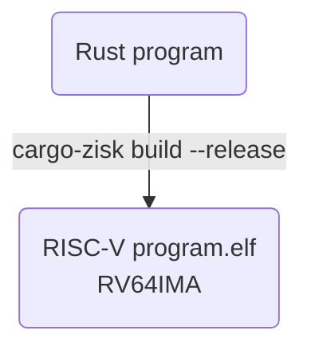
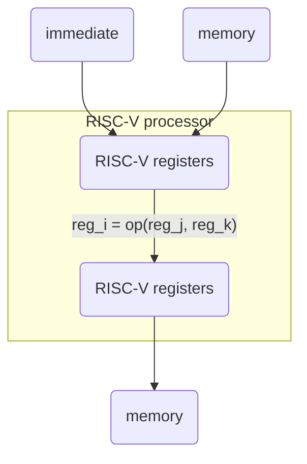
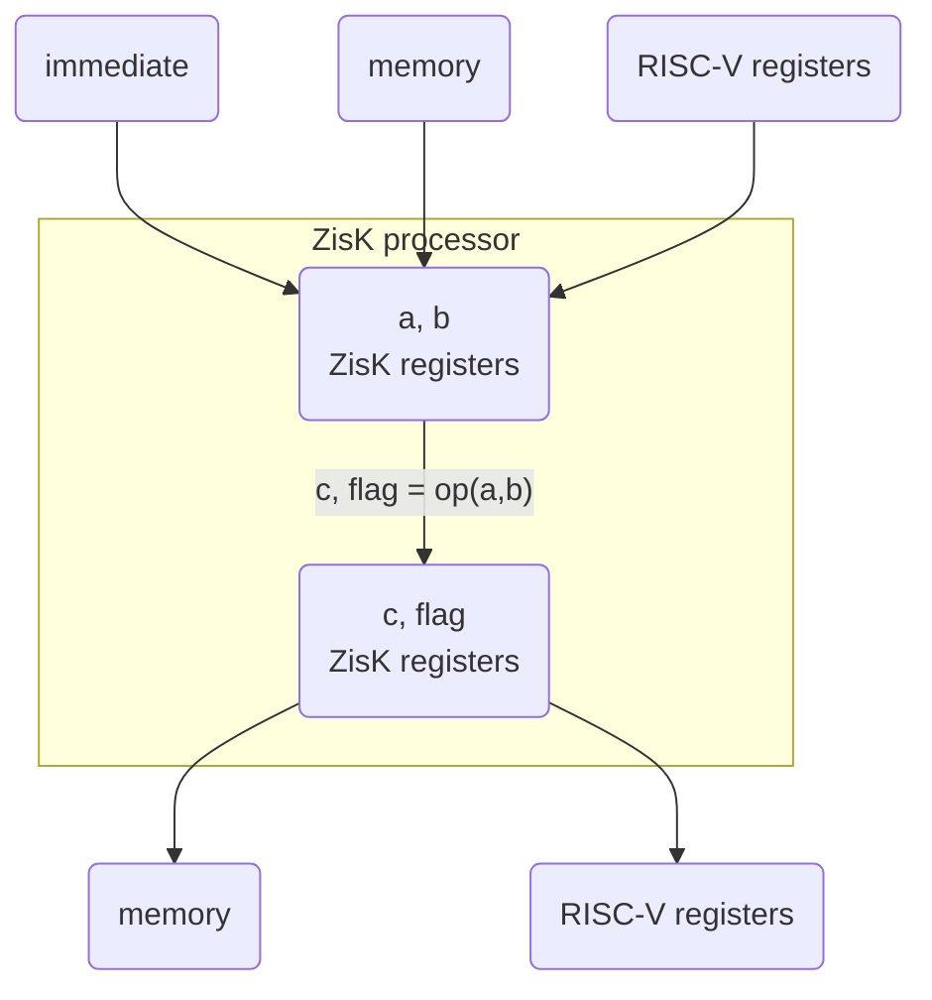
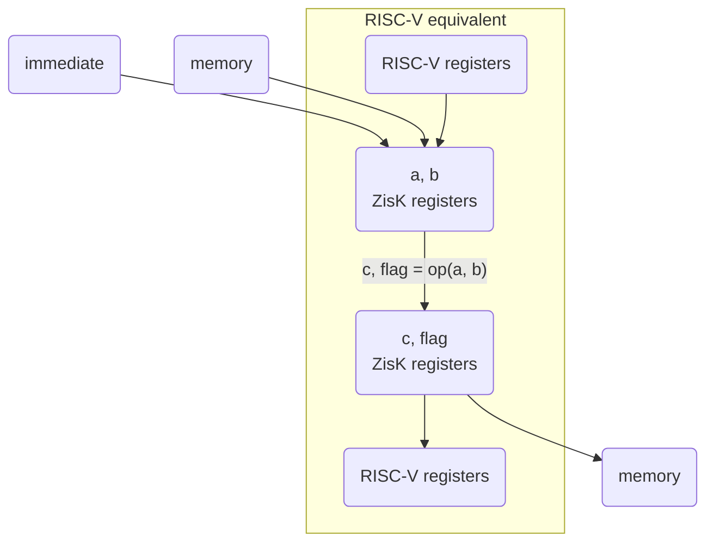
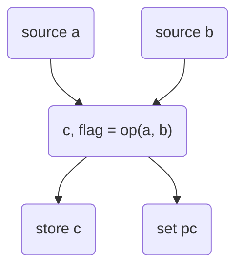
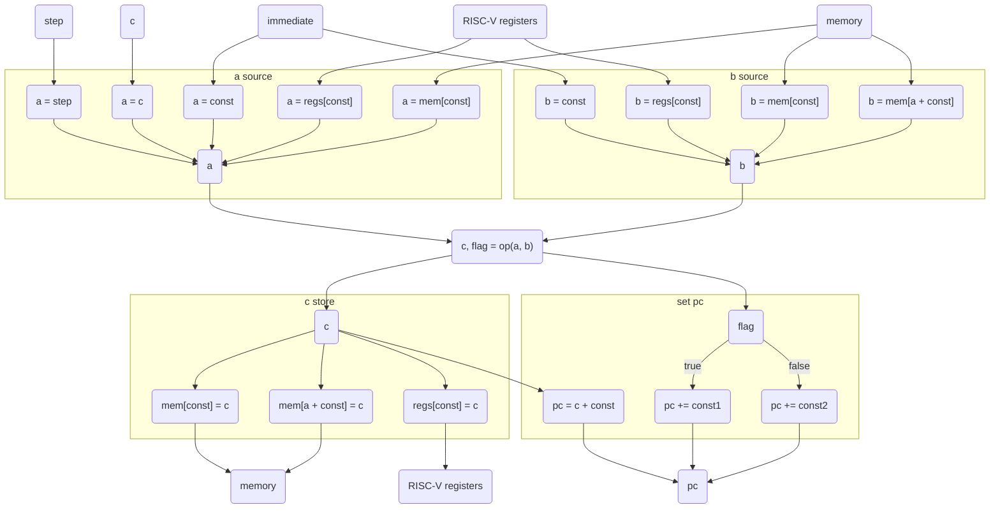
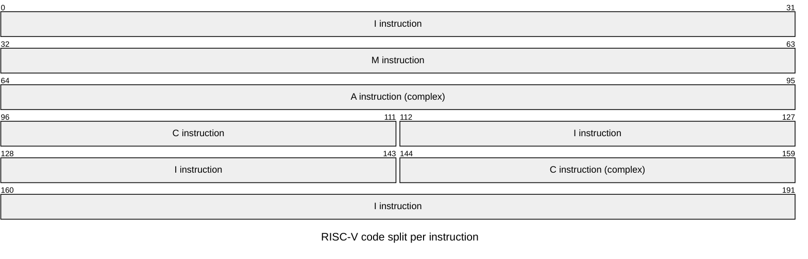
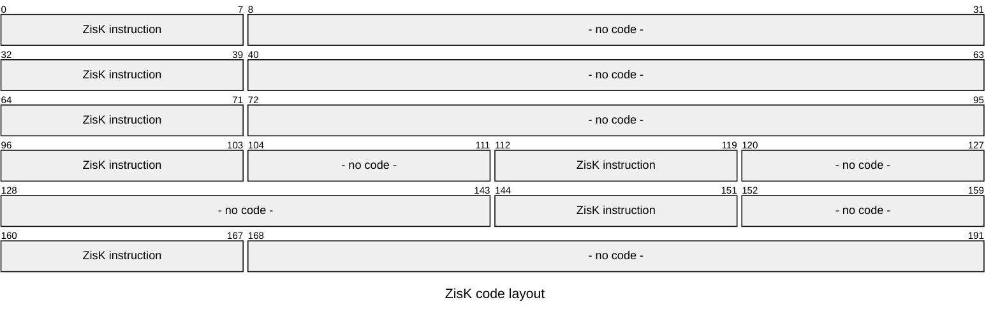
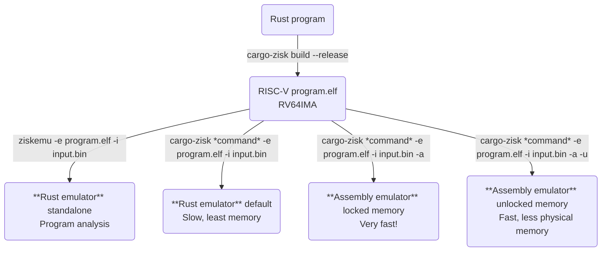

# ZisK Architecture

## Overview

ZisK is a zero-knowledge virtual machine (zkVM).  This section describes the high-level architecture of ZisK.

## Guest program generation

ZisK has been designed to generate zero-knowledge proofs of executions of Rust programs.

ZisK has its own Rust toolchain, which is essentially a standard Rust toolchain with some customizations, for example the ROM and RAM address ranges to be used by the Rust linker.  The ZisK Rust toolchain is invoked when calling `cargo-zisk build --release` from your Rust program project.  This command will generate a RISC-V ELF program file under `<workspace>/target/riscv64ima-zisk-zkvm-elf/release/<program>`.  We will refer to this file as `program.elf` for simplicity, although it can have any name and the .elf extension is not required.

The file `program.elf` is an RV64IMA ELF file, which means:
- It uses 64-bit registers and operations, which provide better performance than 32-bit operations
- Each instruction takes 32 bits of binary code
- It supports the following RISC-V extensions:
  - I: base integer instructions
  - M: integer multiplication and division instructions
  - A: atomic instructions (operations that can read, modify, and write memory safely without interruption)

ZisK supports other RISC-V extensions in order to accommodate other source code compilers like C, C++, and Golang:
- F: single-precision float instructions:
  - Supported through a software float library, since float operations are very complex to prove in zero-knowledge
  - They are low-performance, so we recommend using them as little as possible
- D: double-precision float instructions:
  - Supported through a software float library, since float operations are very complex to prove in zero-knowledge
  - They are low-performance, so we recommend using them as little as possible
- C: compressed instructions:
  - These instructions take 16 bits of binary code instead of the regular 32 bits
  - The encoded size of the instruction has a benefit when executing RISC-V code in HW processors, since it improves the locality of the code: more code fits in every memory page, so fewer memory pages need to be read
  - ZisK does not consume RISC-V code directly, so the size of the RISC-V code has very little impact on ZisK performance



## ZisK processor

RISC-V was designed to be executed in HW processors.  ZisK has its own processor specifically designed with the generation of zero-knowledge proofs in mind.  Still, since it leverages many of the RISC-V operations and features, anybody who is familiar with RISC-V will become rapidly familiar with the ZisK processor.

The main difference between RISC-V and ZisK processors is the usage of registers:
- RISC-V:
  - Supports 32 64-bit registers, named x0, x1, ..., x31
  - Every register can be loaded with an immediate or constant value, read from memory, or written to memory 
  - Instructions can use any register as operand or result, e.g. x1 = x2 AND x3
- ZisK:
  - Supports 3 64-bit registers, named a, b and c, plus a 1-bit flag register
  - Every register can be loaded with an immediate or constant value, read from memory, written to memory, read from a RISC-V register, or written to a RISC-V register
  - Instructions always use a and b registers as operands, and c and flag registers as result, e.g. c = a AND b, flag = 0

The following diagram shows the way RISC-V registers are used in RISC-V operations:



The following diagram shows the way ZisK registers are used in ZisK operations:



Or equivalently:



As you can see, the ZisK processor registers a, b and c are essentially a wrapper on top of the 32 RISC-V registers.  By adding the capability of reading from and writing to RISC-V registers, ZisK sets the instruction operands and result to just `c = op(a, b)`, simplifying the application of constraints and the generation of zero-knowledge proofs.

In order to transparently load a RISC-V register from memory or to store it to memory, ZisK processor supports a new instruction called `copyb`, that simply copies the register b into c, i.e. `c = b`.
For example, if we want to load data from a specific memory address into a specific RISC-V register, we can:
- Load b from memory
- Copy b to c using copyb
- Store c into the specific RISC-V register

This way, you get the equivalent result but constraining the operation to just 3 registers a, b and c, and in that specific order, at the small cost of adding a new a and b source (RISC-V registers) and a new c store (RISC-V registers).

This strategy of decoupling the ZisK registers from the RISC-V registers has the additional value of enabling the integration of ZisK with processors other than RISC-V in the future, following the same principle.

## ZisK instruction

The ZisK emulation process can be pseudo-coded as a loop of emulation of ZisK instructions:

```
pc = 0x1000 // reset the program counter to the first instruction address
for step in 0..max_step
    inst = rom.get_inst(pc) // get the instruction from the ZisK ROM corresponding to this pc
    a = source(inst.source_a) // get the value of a register based on its source
    b = source(inst.source_b) // get the value of b register based on its source
    c, flag = inst.op(a, b) // calculate the value of c and flag registers
    store(inst.store_c, c) // store the value of c register based on its store
    if inst.end break // if reached the end of the program, break the step loop
    pc = inst.set_pc(flag) // calculate the value of the next pc
```

The following diagram shows the ZisK emulation step:



Some details about the emulation process steps:
- The **source of register a** can be any of the following:
  - Immediate: the a value is constant for this instruction
  - Memory: the a value is read from a memory address that is constant for this ZisK instruction
  - Register: the a value is read from a RISC-V register whose index is constant for this ZisK instruction
  - c: the a value is copied from register c, i.e. a is the result of the previously emulated instruction
  - Step: the a value is the current step value
- The **source of register b** can be any of the following:
  - Immediate: the b value is constant for this instruction
  - Memory: the b value is read from a memory address that is constant for this ZisK instruction
  - Register: the b value is read from a RISC-V register whose index is constant for this ZisK instruction
  - Indirect memory: the b value is read from memory using:
    - as the memory address, the value of register a plus an offset that is constant for this ZisK instruction
    - as the value width, either 1, 2, 4 or 8 bytes, being this width value constant for this ZisK instruction
- The **storage of register c** can be any of the following:
  - None: the c value is not stored anywhere; the instruction only produces a value for the next instruction to consume through its a source, and/or a flag
  - Memory: the c value is written to a memory address that is constant for this ZisK instruction
  - Register: the c value is written to a RISC-V register whose index is constant for this ZisK instruction
  - Indirect memory: the c value is written to memory using:
    - as the memory address, the value of register a plus an offset that is constant for this ZisK instruction
    - as the value width, either 1, 2, 4 or 8 bytes, being this width value constant for this ZisK instruction
- The **value of the next pc**, i.e. the program counter of the next ZisK instruction to emulate, can be any of the following:
  - If indicated by the instruction, the value of the c register plus an offset that is constant for this ZisK instruction
  - Else, if the flag register is set to 1, the value of the current pc plus an offset that is constant for this ZisK instruction
  - Else, the value of the current pc plus a different offset that is constant for this ZisK instruction

With this additional information, we can write a more detailed diagram showing how a ZisK instruction is emulated:



There has been a transformation of the classic 32 general purpose register RISC-V processor into a 4 specific purpose register (a, b, c and flag) ZisK processor, with very similar operations and much more zero-knowledge friendly.

## Transpilation

RISC-V processor code is transpiled into ZisK processor code.

Given the similar structure of the RISC-V and ZisK processors, transpiling the RISC-V code is as fast as to load a previously transpiled ZisK binary file.  For this reason, the transpilation is done every time we need to use the `program.elf` file.  The result of the transpilation is a ZisK ROM binary structure that contains a map of ZisK instructions indexed by their ROM address.

RV64IMA instructions are 32-bit long and 32-bit aligned.  ZisK instruction addresses are 8-bit (i.e. byte) aligned.  Most RV64IMA instructions can be transpiled to one single ZisK instruction, and they keep the ROM address of the RISC-V instruction they come from.  However, atomic instructions require the combination of 2, 3 or even 4 ZisK instructions.

ZisK transpiler takes advantage of the fact that RISC-V instruction addresses are 32-bit aligned by placing these additional ZisK instructions at addresses that are not 32-bit aligned, where they can never collide with a transpiled RISC-V instruction.  These extra instructions are called *internal* instructions, and they are not placed right after the instruction that generated them: they are allocated from a single pool of odd addresses that starts at `ROM_ADDR` and grows in transpilation order, i.e. `ROM_ADDR + 1`, `ROM_ADDR + 3`, `ROM_ADDR + 5`, etc.

RISC-V C extension instructions are 16-bit long and 16-bit aligned.  When using C extension, 16-bit and 32-bit instructions (from C and non-C RISC-V extensions) are combined in potentially any order, so in general they are 16-bit aligned.  Most C extension instructions require 1 single ZisK instruction to implement them; when more are needed, the extra instructions come from the same internal address pool.

For example, the following RISC-V code contains instructions of diverse length and complexity, starting at address 0 for simplicity:



The resulting ZisK code keeps exactly one instruction at each original RISC-V instruction address:



Note that the ZisK instructions do not have an actual bit length but they have been represented as 8-bit instructions since their address is just 8-bit aligned.

The extra ZisK instructions required by the complex A and C instructions of the example are not placed next to them, but taken from the internal address pool, in transpilation order:

|ZisK ROM address|Instruction|
|---|---|
|ROM_ADDR + 1|A instruction, 2nd ZisK instruction|
|ROM_ADDR + 3|A instruction, 3rd ZisK instruction|
|ROM_ADDR + 5|C instruction, 2nd ZisK instruction|

## Address map

This is the ZisK high-level address map:

|From|To|Usage|
|---|---|---|
|0x1000|0x0FFFFFFF|ziskos ROM|
|0x40000000|0x7FFFFFFF|Input data|
|0x80000000|0x87FFFFFF|ROM|
|0xA0000000|0xBFFFFFFF|RAM|


ZisK code is the result of the RISC-V code transpilation, but it also contains some additional ziskos code that implements some infrastructure tasks.  The following tables describe the different address ranges and their usage.

ROM address map:

|Address|Usage|
|---|---|
|0x1000|ROM_ENTRY.  Initial execution address.  It simply jumps to the program launcher code.|
|0x1004|ROM_EXIT. Final execution address.  It exits the program.|
|0x1008|FLOAT_HANDLER_ADDR.  Saves RISC-V registers, calls the float library, and restores the saved registers.  Called when an F or D extension instruction is transpiled.|
|0x1110|Program launcher code.  It writes initial values of ROM and RAM globals.  It saves some data and jumps to the first program instruction at 0x80000000.  Syscall trap handler, including the exit sequence to make output public and jump to the ROM_EXIT address.  This address corresponds to a float-enabled build; when ZisK is built without the `float` feature there is no float handler and the launcher starts at 0x1008 instead.|
|0x80000000|Program code.  When done, a syscall is called to end the execution.|
|0x87F00000|Float soft library code|

RAM address map:

|Address|Usage|
|---|---|
|0xA0000000|RAM_ADDR, also STACK_ADDR.  Program stack (4 MB).|
|0xA0400000|SYS_ADDR.  ziskos system RAM (64 KB).  It holds the 32 memory-mapped RISC-V general registers at +0x0, the UART at +0x200, the float registers at +0x1000, and the CSRs at +0x8000.|
|0xA0410000|OUTPUT_ADDR.  Program output RAM data (128 KB).|
|0xA0430000|Program RAM: .data, .bss and heap.|
|0xBFFF0000|Float soft library RAM (64 KB).|


## Emulation

ZisK guest programs can be emulated in different ways:
- Rust emulator:
  - This is the default emulator used by `cargo-zisk`
  - Slow, but good for checking and analyzing the guest program, and it has the lowest memory requirements
  - You can also run it standalone through the `ziskemu` program, to transpile and emulate your ELF program file with a specific binary input file
  - ziskemu is part of the ZisK installation (located in `~/.zisk/bin/ziskemu`)
  - When developing programs for ZisK, it is a good practice to use `ziskemu` at least once after generating the program elf file in order to check that the generated file can be successfully transpiled and run on the ZisK processor
  - Usage: `ziskemu -e file.elf -i input.bin`, where `file.elf` is the RISC-V ELF program file and `input.bin` is the input data in binary format
  - `ziskemu` also can provide a lot of statistical information about the emulation that can help you optimize your program for ZK proof generation on ZisK; you can see the complete description of `ziskemu` functionality in [Profiling Programs](./profiling.md)
- Assembly emulator:
  - Very fast!
  - You opt into it by adding the `-a` (`--asm`) parameter to the `cargo-zisk` command, e.g. `cargo-zisk prove -e program.elf -i input.bin -a`
  - The first command that needs it generates the assembly code from the program ELF file and compiles it into a program-specific emulator binary, which makes that first call slower.  The result is cached, so the following calls reuse it.
  - The assembly emulator requires some startup time before starting the first emulation.  This startup time is part of the cargo-zisk call duration.  When working with ZisK as a service, this time will not be part of the service call, providing the fastest possible emulation time.
  - The assembly emulator uses shared memory to exchange data with the parent ZisK process.  This shared memory is locked to physical memory for performance reasons.  If you don't want to use so much physical memory, you can add the parameter `-u` (`--unlock-mapped-memory`, only valid together with `-a`) to unlock the shared memory from physical memory.  This parameter also speeds up the startup time, which can reduce the duration when emulating short program executions.

The following diagram shows the different emulation modes:

