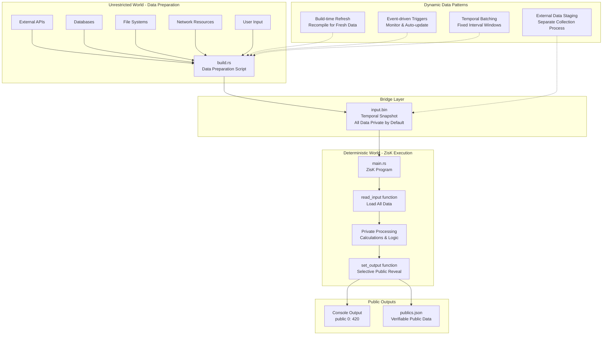

# Understanding I/O with ZisK

In the Quick Start section, we had a brief introduction to how to perform I/O operations with ZisK. Now we'll dive deeper into the fundamental concepts. Keep reading to learn more about:



- How ZisK's input/output model works at its core
- The distinction between public and private data
- Working with dynamic data streams at ZisK
  
## Setting up the Stage

#### The zkVM I/O Challenge

Zero-knowledge virtual machines operate under unique constraints that traditional programs don't face. The core challenge is maintaining deterministic execution while preserving privacy and enabling verification.

When you run a regular program, you can fetch data, read files, or get user input at runtime. In a zkVM, this approach breaks down because:

- Verifiers must be able to reproduce the computation without re-executing it.
- The same inputs must always produce the same outputs. 
- Some data must remain hidden while other data needs to be public. 

ZisK solves this through a carefully designed architecture that separates data preparation from execution.
  

## ZisK's Data Model


ZisK takes a fundamentally different approach to handling I/O, Instead of allowing direct access to files, networks, or user input during execution, ZisK uses a controlled I/O model. This approach ensures deterministic execution, maintains privacy by default, and enables verifiable computation without revealing sensitive data.

The core concept is simple: ZisK handles I/O through a file-based communication pattern where you generate an `input.bin` file from `build.rs` and process that data in `main.rs` using ZisK's `read_input()` and `set_output()`  functions. 

This separation between data preparation (unrestricted) and data processing (verifiable) gives you complete control over what becomes public versus what remains private, while ensuring that the same inputs always produce the same verifiable outputs.

*Let's dive into the section of Handling Input and Making Data Public.* 

### Input Handling
If we look at the SHA example we worked with earlier, you'll notice that ZisK programs receive all their input through a single file called `input.bin`. Unlike traditional programs that can read files or make network requests during execution, this single-file approach is how ZisK handles all input data.

Your `build.rs` script is where you prepare this input. Here you have full access to external resources - fetch APIs, read databases, process user input, whatever you need. You're essentially creating a **snapshot** of data that will be processed deterministically by the zkVM.


```rust
// Ref. build.rs from the SHA example - Here we prepare the data for Input.bin
let secret_value: u64 = 42;
file.write_all(&secret_value.to_le_bytes())?;
```

Once your program runs inside ZisK, the `read_input()` function gives you access to everything you prepared. It returns the entire `input.bin` contents as bytes - all the data you wrote in `build.rs` is now available to work with .

```rust
// Ref. main.rs from SHA example - Here we read data from the input.bin file and load it into the main.rs 

let input: Vec<u8> = read_input();
let secret_value = u64::from_le_bytes(input[0..8].try_into().unwrap());
```

Here's the key insight, **All input starts as private by default**. ZisK doesn't distinguish between "public" and "private" input during the reading process. Instead, the `set_output()` function (which we'll explore next) is what determines what becomes public. By default, everything you input/work with remains private. 

*Make sure your input data isn't redundant. Since all input must go into your `input.bin` file and gets processed by the zkVM, any unnecessary or duplicate data will make your file larger and slow down your computation. Keep your inputs lean and purposeful.*

### Making Data Public

So far, everything you've done in your ZisK program has been completely private. Your input data, calculations, and intermediate values remain private. But when you need to prove something or share a result, you need a mechanism to selectively reveal information.

The `set_output()` function serves this exact purpose. It's your **only pathway** to make data visible outside ZisK. Once you call this function, that specific piece of data becomes accessible to be  verifiable.

```rust
// So to see thin in the context of the syntax if we see in main.rs
let result = secret_value * 10;  // This stays private
set_output(0, result as u32);    // This becomes public
```

When you call `set_output()`, two things happen simultaneously. You'll see the value immediately displayed on your console as `public 0: 420`, When you write `set_output(0, 420)` in your code, ZisK immediately prints `public 0: 420` to the console, where "public" indicates this is a public output, "0" is the index you specified, and "420" is the actual value. 

This format gives you an immediate feedback about what values you're making public and shows you exactly how they'll be organized in the final `publics.json` file that gets created during proving.

Multiple values can be made public by calling `set_output()` with different index parameters, where each index serves as a unique identifier to organize the public outputs.
```rust
set_output(0, timestamp as u32);     // When computation happened
set_output(1, result as u32);        // The actual result
set_output(2, status_flag as u32);   // Success/failure indicator
```

This approach gives you control over what information becomes public versus what stays private. Any data you don't explicitly pass to `set_output()` remains hidden from verifiers - they can only see the values you choose to reveal.
  
## Working with dynamic data streams at ZisK

### The Challenge with Streaming Data

Okay so ZisK's I/O model is built around snapshots i.e. you create an `input.bin` file and your program processes it deterministically. But what happens when you need to work with continuously changing data, like live market feeds, real-time sensor data, or streaming blockchain events?

Since ZisK requires deterministic inputs for proof generation, you can't simply fetch live data from within your program. Instead, you need formalized approaches for handling dynamic data streams while maintaining ZisK's deterministic properties.

### Bridging Static and Dynamic data to ZisK

The solution space is quite rich, and your choice depends on latency requirements and operational constraints.

One popular approach could leverage Cargo's build system as your data acquisition layer. By repurposing `build.rs` to fetch fresh data during compilation, each build cycle captures a temporal snapshot. Your main ZisK program remains unchanged; it simply processes whatever data the build system has prepared.

Alternatively, you might separate data collection from proof generation entirely. External processes continuously maintain staged data files, while ZisK programs consume these pre-prepared snapshots on demand. This decoupling provides flexibility in how and when data gets refreshed.

For applications that can tolerate batching, accumulating streaming data over fixed intervals works well. So in this case you're creating discrete temporal windows that maintain deterministic properties while capturing real-world data evolution.

Or maybe using proxy input generation, where external services or scheduled jobs maintain current data snapshots. The ZisK programs then consume these externally-managed files rather than handling data acquisition themselves.

Event-driven approaches can also be effective: monitor data sources for changes and trigger recompilation automatically. This ensures proofs always reflect current data without manual intervention.

The key insight is that all these patterns preserve ZisK's deterministic execution model while enabling different temporal guarantees. Your choice comes down to balancing latency requirements, operational complexity, and your broader system architecture.

## Wrapping Up: ZisK's I/O Philosophy

ZisK's approach to I/O represents a fundamental shift in how we think about data flow in computational systems. By separating data preparation from execution, you gain something powerful: the ability to work with any data source while maintaining the deterministic properties essential for zero-knowledge proofs.

The core pattern we've explored is elegant in its simplicity. Your `build.rs` operates in the unrestricted world where you can fetch APIs, read databases, and process complex data sources. Your `main.rs` operates in the deterministic world where the same inputs always produce the same verifiable outputs. The `input.bin` file serves as the bridge between these two worlds.

This architecture gives you complete control over privacy. Everything starts private by default, and only the data you explicitly pass to `set_output()` becomes visible to verifiers. This privacy-by-default approach means you can process sensitive information while selectively revealing just the results that matter.

For dynamic data scenarios, the solutions we've discussed all maintain this core philosophy while adapting to real-world constraints. Whether you choose build-time refresh, external data staging, or event-driven approaches, the fundamental principle remains: capture temporal snapshots that ZisK can process deterministically.

The beauty of this model is that it scales from simple proofs to complex, real-world applications without compromising on the security and verifiability properties that make zero-knowledge computation valuable. You're not just writing programs; you're creating verifiable computational artifacts that others can trust without needing to see your private data or re-execute your code.