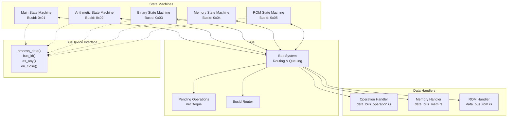

# The Bus System

ZisK's bus system connects all components and manages data flow between state machines. Unlike traditional computer buses that focus only on performance, ZisK's bus system captures every data transfer as part of the execution trace needed for zero-knowledge proof generation.

## Bus Design Principles

The bus serves dual purposes: it moves data between components and creates a comprehensive audit trail of all system interactions. Every data transfer gets captured and structured to feed directly into the mathematical constraints that power zero-knowledge proofs.

This design ensures that all communication contributes to proof generation while enabling efficient distributed operation across multiple machines.

## Core Interface: BusDevice Trait

Every component in ZisK implements the `BusDevice` trait to participate in the communication system.

**File:** `common/src/bus/bus_device.rs`

```rust
pub trait BusDevice<D>: Any + Send + Sync {
    fn process_data(&mut self, bus_id: &BusId, data: &[D], pending: &mut VecDeque<(BusId, Vec<D>)>);
    fn bus_id(&self) -> Vec<BusId>;
    fn as_any(self: Box<Self>) -> Box<dyn Any>;
    fn on_close(&mut self) {}
}

```

**Method breakdown:**

**`process_data()`** - Handles incoming data for the device. When data arrives:

-   Receives the source bus ID and data payload
-   Processes data according to the device's specific logic
-   Can queue additional operations in the `pending` queue for other devices
-   Creates a chain of data flow captured in the execution trace

**`bus_id()`** - Returns all bus IDs this device responds to. Some devices handle multiple logical addresses or have different interfaces for different operation types.

**`as_any()`** - Enables runtime type casting, allowing the bus system to work with different device types while maintaining type safety.

**`on_close()`** - Cleanup hook for device shutdown, ensuring proper resource management.

## Device Identification: BusId

**File:** `common/src/bus/bus_id.rs`

```rust
#[derive(Debug, Clone, Copy, PartialEq)]
pub struct BusId(pub usize);

```

Each `BusId` uniquely identifies a device or interface on the bus. The `usize` provides a flat address space that efficiently routes data to the correct component.

**Zero-knowledge relevance:** The bus ID becomes part of the execution trace. When the prover generates constraints, it must prove that data went to the correct destination. The simple, deterministic addressing scheme makes these proofs more efficient.

## Metrics and Monitoring

**File:** `common/src/bus/bus_device_metrics.rs`

```rust
pub trait BusDeviceMetrics: BusDevice<u64> + Metrics + std::any::Any {}

```

This trait combines core bus functionality with metrics collection. Devices implementing this provide insights into:

-   Data throughput and latency
-   Operation counts and patterns
-   Performance bottlenecks
-   Resource utilization

These metrics are essential for understanding system performance across distributed environments.

## Specialized Data Handlers

The bus system provides specialized handlers for different data types rather than using a generic approach:

### Operation Data Handler

**File:** `common/src/bus/data_bus_operation.rs`

Handles operation-specific communication:

-   Instruction dispatch from main state machine to specialized processors
-   Result collection from arithmetic and binary operations
-   Control flow coordination between execution units

### ROM Data Handler

**File:** `common/src/bus/data_bus_rom.rs`

Manages read-only memory interactions:

-   Program instruction fetching
-   Constant data access
-   Program integrity verification during execution

### Memory Data Handler

**File:** `common/src/bus/data_bus_mem.rs`

Handles dynamic memory operations:

-   RAM read/write operations
-   Memory alignment and access patterns
-   Memory tracing for proof generation

## Data Flow Process

Here's how data moves through the system:

1.  **Initiation:** A state machine needs to communicate with another component
2.  **Queuing:** The operation gets queued using the appropriate data handler
3.  **Routing:** The bus system examines the target `BusId` and routes data to the correct device
4.  **Processing:** The target device's `process_data()` method handles the operation
5.  **Cascading:** If the operation triggers additional work, new operations get added to the pending queue
6.  **Tracing:** Every step gets recorded for the execution trace

## Zero-Knowledge Optimization

ZisK's bus system optimizes for **verifiability** rather than just speed:

**Deterministic Ordering:** The queue-based approach ensures operations happen in predictable order, crucial for generating consistent proofs.

**Complete Traceability:** Every data transfer creates execution trace entries. This comprehensive logging means the prover can demonstrate exactly what data moved where and when.

**Modular Verification:** Different data handlers can implement domain-specific verification logic. The arithmetic unit can prove its computations are correct, while the memory unit can prove accesses were legitimate.

**Distributed Proof Generation:** Clear device interfaces and identities enable different parts of the proof to be generated on different machines and then combined.

## Performance Characteristics

**Latency:** The queue-based system introduces minimal overhead compared to direct function calls, but comprehensive tracing provides significant benefits for proof generation.

**Throughput:** The generic design allows batching operations and parallel processing where the dependency graph permits.

**Scalability:** New device types can be added without modifying existing components - they just need to implement the `BusDevice` trait and register appropriate bus IDs.

## State Machine Integration

The bus system enables the state machine architecture. Each state machine (Main, Arithmetic, Binary, Memory, ROM) implements the `BusDevice` trait and uses the bus for:

-   **Coordination:** The main state machine orchestrates other components via bus messages
-   **Data Exchange:** Arithmetic results flow back to the main processor through the bus
-   **Resource Sharing:** Multiple state machines access shared resources like memory through standardized interfaces

## Adding New Components

Adding a new component to ZisK involves:

1.  **Implement `BusDevice<T>`** for your component with appropriate data type `T`
2.  **Choose unique `BusId`(s)** for your component's interfaces
3.  **Register with the bus system** during initialization
4.  **Handle incoming data** in your `process_data()` implementation
5.  **Optionally implement metrics** via `BusDeviceMetrics` for monitoring

Existing components don't need to know about new devices - they send data to bus IDs, and the system handles routing automatically.

## Development Support

The module system in `common/src/bus/mod.rs` provides utilities for:

-   **Bus timing analysis** - Understanding data flow patterns and bottlenecks
-   **Debug tracing** - Following data through the system during development
-   **Component lifecycle management** - Proper initialization and cleanup

This makes ZisK development more manageable than traditional zkVM architectures where component interactions are often implicit and hard to debug.

## Bus System Architecture



## Architecture Benefits

ZisK's bus system treats communication as a first-class component that directly supports zero-knowledge proof generation requirements. This approach enables:

-   **Modularity:** Components can be developed and optimized independently
-   **Distributed operation:** Seamless scaling across multiple machines
-   **Comprehensive traceability:** Complete audit trail for proof generation
-   **Performance optimization:** Targeted optimizations while maintaining mathematical rigor

The bus system provides the foundation for ZisK's modular, scalable, and verifiable architecture.