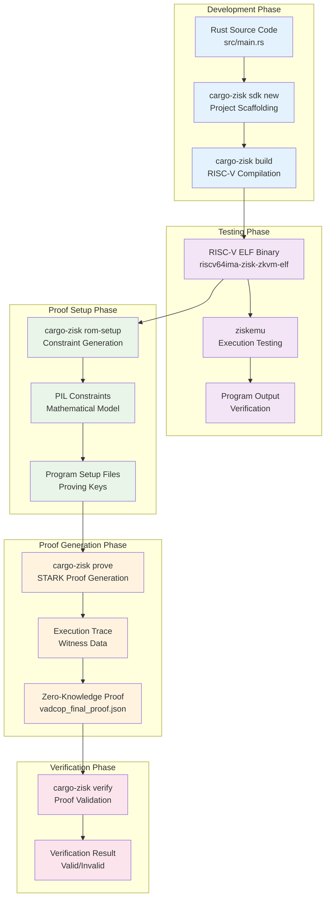

# Execution Pipeline

ZisK's execution pipeline transforms Rust code into cryptographically verifiable proofs that the computation happened correctly. The process enables anyone to verify program execution without seeing the actual data or computation steps.

## Pipeline Overview

The pipeline consists of several phases, each building on the previous one. Here's what happens at each step and why it matters.
</pre>

<pre>

## 1. Project Creation & Setup

ZisK provides a project scaffolding system that creates the correct structure for zero-knowledge programs.

**Tool:** `cargo-zisk sdk new <project_name>`

**Process:** This command generates a complete project structure with configuration files, build scripts, and example code. Running `cargo-zisk sdk new sha_hasher` creates a working SHA-256 hasher project you can immediately build and prove.

**Output:**

-   `src/main.rs` - Your program logic
-   `build.rs` - Build configuration and input file generation
-   `Cargo.toml` - Dependencies and target configuration
-   Input files in the `build/` directory

**Purpose:** The scaffolding configures your project for the RISC-V target architecture that ZisK's zkVM requires. Standard Rust projects won't compile to the right instruction set without this setup.

## 2. Compilation: Rust → RISC-V

High-level Rust code gets transformed into machine code that ZisK's virtual machine can understand and prove.

**Tool:** `cargo-zisk build --release`

**Process:** ZisK uses a specialized Rust toolchain that targets the RISC-V 64-bit instruction set (`riscv64ima-zisk-zkvm-elf`). The resulting binary must be deterministic and suitable for zero-knowledge proving.

**Output:** An ELF binary at: `target/riscv64ima-zisk-zkvm-elf/release/<program_name>`

**Key difference:** Unlike regular compilation, this process ensures the binary can execute inside ZisK's zkVM. The compiler includes special runtime libraries and follows strict rules about memory layout and instruction usage.

## 3. Emulation & Testing

Before generating expensive proofs, you need to verify your program works correctly. ZisK's emulator lets you test execution without cryptographic overhead.

**Tool:** `ziskemu` or `cargo-zisk run`

**Process:** The emulator creates a virtual RISC-V environment and executes your ELF binary exactly as it would run during proof generation. This catches bugs early and verifies outputs before proving.

**Command examples:**

-   Direct emulation: `ziskemu -e target/riscv64ima-zisk-zkvm-elf/release/sha_hasher -i build/input.bin`
-   Integrated workflow: `cargo-zisk run --release -i build/input.bin`

**Output:** The actual program outputs, exactly as they would appear during proving. For a SHA hasher, you'd see the hash values printed out.

**Background:** The emulator generates detailed execution traces (registers, memory operations, I/O) that mirror what happens during proof generation, but without the cryptographic work.

## 4. ROM Setup: Preparing for Proof Generation

Before ZisK can generate proofs for your program, it analyzes the program structure and creates specialized constraint files.

**Tool:** `cargo-zisk rom-setup`

**Process:** This step analyzes your compiled ELF binary and generates program-specific setup files that define the mathematical constraints your program must satisfy during execution.

**Command:** `cargo-zisk rom-setup -e target/riscv64ima-zisk-zkvm-elf/release/sha_hasher`

**What happens:** ZisK examines every instruction in your program and creates a mathematical representation (using PIL - Polynomial Identity Language) that describes what "correct execution" means for your specific code.

**Purpose:** Zero-knowledge proofs work by proving that a computation satisfies mathematical constraints. This step transforms your program logic into those constraint equations.

## 5. Proof Generation

ZisK generates a mathematical proof that your program executed correctly with specific inputs, without revealing anything about the execution process itself.

**Tool:** `cargo-zisk prove`

**Process:** ZisK executes your program in its zkVM, captures every step of execution, and transforms this execution trace into a STARK (Scalable Transparent Argument of Knowledge) proof.

**Command:**

```bash
cargo-zisk prove -e target/riscv64ima-zisk-zkvm-elf/release/sha_hasher \
                 -i build/input.bin \
                 -o proof \
                 -a -y

```

**Proof generation steps:**

1.  **Execution:** Your program runs inside the zkVM with the provided inputs
2.  **Trace generation:** Every instruction, memory access, and state change gets recorded
3.  **Witness computation:** The execution trace gets transformed into mathematical witness data
4.  **STARK proof generation:** Using the witness and your program's constraints, ZisK generates the final proof

**Output:** A complete proof package in the specified directory (`./proof/`) containing:

-   `vadcop_final_proof.json` - The actual zero-knowledge proof
-   `publics.json` - Public inputs and outputs
-   Various intermediate files

**Performance notes:** This is the most computationally intensive step. ZisK supports GPU acceleration and concurrent proving to reduce the time required.

## 6. Verification: Cryptographic Validation

The final step proves that a given proof is mathematically valid and corresponds to the claimed computation.

**Tool:** `cargo-zisk verify`

**Process:** The verifier checks the proof against the public inputs and program commitments using ZisK's verification algorithm. This process is much faster than proof generation.

**Command:**

```bash
cargo-zisk verify -p ./proof/proofs/vadcop_final_proof.json \
                  -u ./proof/publics.json

```

**Verification checks:**

-   The proof is mathematically sound
-   The computation used the claimed program (via cryptographic program commitment)
-   The public outputs match what the proof claims
-   All constraints were satisfied during execution

**Result:** If verification passes, you get confirmation that the proof is valid. Anyone can run this verification independently.

## Complete Workflow Example

Here's what a typical ZisK development session looks like:

```bash
# Create and enter project
cargo-zisk sdk new my_program
cd my_program

# Test natively first
cargo run

# Build for zkVM
cargo-zisk build --release

# Test in emulator
cargo-zisk run --release -i build/input.bin

# Prepare for proving
cargo-zisk rom-setup -e target/riscv64ima-zisk-zkvm-elf/release/my_program

# Generate proof
cargo-zisk prove -e target/riscv64ima-zisk-zkvm-elf/release/my_program \
                 -i build/input.bin -o proof -a -y

# Verify the proof
cargo-zisk verify -p ./proof/proofs/vadcop_final_proof.json \
                  -u ./proof/publics.json

```

## Architecture Integration

This pipeline integrates with ZisK's modular architecture. During proof generation, the various state machines (Main, Arithmetic, Binary, Memory, ROM) coordinate to handle different aspects of RISC-V instruction execution, while the PIL constraint system ensures mathematical soundness throughout the process.

## Performance Characteristics

**Compilation:** Fast, similar to regular Rust compilation **Emulation:** Very fast, useful for rapid iteration  
**ROM Setup:** One-time cost per program, moderate duration **Proof Generation:** Most expensive step, benefits significantly from GPU acceleration **Verification:** Fast, suitable for real-time validation

The pipeline is designed to frontload the expensive operations (ROM setup, proving) while keeping the verification step lightweight enough for practical deployment scenarios.

## Installation

ZisK currently supports **Linux x86_64** and **macOS** platforms.

> **Note:** Proof generation and verification on **macOS** are not yet supported. We're actively working to add this functionality.

**Requirements:**

-   **Ubuntu 22.04 or higher**
-   **macOS 14 or higher**

1.  Make sure you have [Rust](https://www.rust-lang.org/tools/install) installed.
    
2.  Install required dependencies:
    

**Ubuntu:**

```bash
sudo apt-get install -y xz-utils jq curl build-essential qemu-system libomp-dev libgmp-dev nlohmann-json3-dev protobuf-compiler uuid-dev libgrpc++-dev libsecp256k1-dev libsodium-dev libpqxx-dev nasm libopenmpi-dev openmpi-bin openmpi-common

```

**macOS:**

```bash
brew reinstall jq curl libomp protobuf openssl nasm pkgconf open-mpi libffi

```

3.  Install ZisK using ziskup:

```bash
curl https://raw.githubusercontent.com/0xPolygonHermez/zisk/main/ziskup/install.sh | bash

```

## Create a Project

Generate a new example project using the `cargo-zisk sdk new <name>` command:

```bash
cargo-zisk sdk new sha_hasher
cd sha_hasher

```

This creates a project with the following structure:

```
.
├── build.rs
├── Cargo.toml
├── .gitignore
└── src
    └── main.rs

```

The example program takes a number `n` as input and computes the SHA-256 hash `n` times. The `build.rs` file generates an `input.bin` file containing the value of `n` (e.g., 20).

You can run the program on your native architecture:

```bash
cargo run

```

Output:

```
public 0: 0x98211882
public 1: 0xbd13089b
public 2: 0x6ccf1fca
public 3: 0x81f7f0e4
public 4: 0xabf6352a
public 5: 0x0c39c9b1
public 6: 0x1f142cac
public 7: 0x233f1280

```

## Build

Build the program using `cargo-zisk` to generate a RISC-V ELF file:

```bash
cargo-zisk build --release

```

This builds the program using the `zkvm` target. The resulting `sha_hasher` ELF file is generated in the `./target/riscv64ima-zisk-zkvm-elf/release` directory.

## Execute

Test the program using the ZisK emulator before generating proofs:

```bash
ziskemu -e target/riscv64ima-zisk-zkvm-elf/release/sha_hasher -i build/input.bin

```

Output:

```
98211882
bd13089b
6ccf1fca
81f7f0e4
abf6352a
0c39c9b1
1f142cac
233f1280

```

Alternatively, build and run in one command:

```bash
cargo-zisk run --release -i build/input.bin

```

## Prove

Generate the program setup files:

```bash
cargo-zisk rom-setup -e target/riscv64ima-zisk-zkvm-elf/release/sha_hasher

```

Generate and verify a proof:

```bash
cargo-zisk prove -e target/riscv64ima-zisk-zkvm-elf/release/sha_hasher -i build/input.bin -o proof -a -y

```

This generates the proof in the `./proof` directory. Success looks like:

```
...
[INFO ] ProofMan: ✓ Vadcop Final proof was verified
[INFO ] stop <<< GENERATING_VADCOP_PROOF 91706ms
[INFO ] ProofMan: Proofs generated successfully

```

**Note:** You can use concurrent proof generation and GPU support to reduce proving time.

## Verify Proof

Verify a generated proof:

```bash
cargo-zisk verify -p ./proof/vadcop_final_proof.bin

```