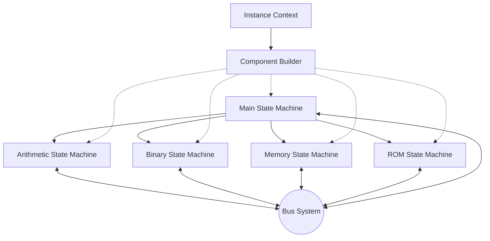

# State Machine Architecture

ZisK uses a modular state machine architecture that breaks program execution into specialized processing units. Rather than using a single monolithic processor, ZisK decomposes computation into domain-specific state machines that handle arithmetic, memory, binary operations, and program storage independently. This specialization enables targeted optimizations and parallel processing while maintaining the mathematical rigor required for zero-knowledge proof generation.

## Why Specialized State Machines?

Traditional virtual machines use general-purpose processors that handle all operations uniformly. ZisK recognizes that different types of computations have fundamentally different mathematical properties and constraint requirements. By creating dedicated state machines for each domain, ZisK can apply optimizations that would be impossible in a general-purpose design.

Each state machine is designed specifically for **witness computation** - the process of generating mathematical evidence needed for zero-knowledge proofs. Every operation and state transition gets captured in a format that directly feeds into the constraint system.

## Core Interface: Instance Trait

Every state machine implements the `Instance` trait, which defines the standard interface for all computational units in ZisK.

**File:** `common/src/component/component_instance.rs`

rust

```rust
pub trait Instance<F: PrimeField64>: Send + Sync {
    /// Computes the witness for the instance based on the proof context
    fn compute_witness(
        &self,
        _pctx: &ProofCtx<F>,
        _sctx: &SetupCtx<F>,
        _collectors: Vec<(usize, Box<dyn BusDevice<PayloadType>>)>,
        trace_buffer: Vec<F>,
    ) -> Option<AirInstance<F>> { None }
    
    /// Retrieves the checkpoint associated with the instance
    fn check_point(&self) -> CheckPoint;
    
    /// Retrieves the type of the instance
    fn instance_type(&self) -> InstanceType;
    
    /// Builds an input collector for the instance
    fn build_inputs_collector(
        &self,
        chunk_id: ChunkId,
    ) -> Option<Box<dyn BusDevice<PayloadType>>> { None }
    
    fn debug(&self, _pctx: &ProofCtx<F>, _sctx: &SetupCtx<F>) {}
    fn reset(&self) {}
}
```

**Key methods explained:**

**`compute_witness()`** - Transforms the execution trace into an `AirInstance` - the algebraic representation used for proof generation. The `trace_buffer` contains field elements that capture every state transition.

**`check_point()`** - Returns the current execution checkpoint, enabling ZisK to pause, resume, or analyze execution at specific points. Critical for distributed proving where different machines handle different execution segments.

**`instance_type()`** - Identifies what kind of computation this instance handles, allowing the proving system to apply the correct constraint sets.

**`build_inputs_collector()`** - Creates a `BusDevice` that can collect inputs for this specific instance, integrating with the bus system.

**`reset()`** - Reinitializes the instance for fresh execution, essential for running multiple programs.

## State Machine Construction

State machines are built through a factory pattern that ensures proper initialization and configuration.

**File:** `common/src/component/component_builder.rs`

rust

```rust
pub trait ComponentBuilder<F: PrimeField64>: Send + Sync {
    fn build_counter(&self) -> Option<Box<dyn BusDeviceMetrics>>;
    fn build_planner(&self) -> Box<dyn Planner>;
    fn configure_instances(&self, pctx: &ProofCtx<F>, plannings: &[Plan]) {}
    fn build_instance(&self, ictx: InstanceCtx) -> Box<dyn Instance<F>>;
    fn build_inputs_generator(&self) -> Option<Box<dyn BusDevice<PayloadType>>> { None }
}
```

**Construction process:**

1.  **`build_counter()`** - Creates metrics collectors for performance monitoring
2.  **`build_planner()`** - Generates execution plans for resource allocation
3.  **`configure_instances()`** - Sets up instances based on execution context
4.  **`build_instance()`** - Creates the instance with its specific context
5.  **`build_inputs_generator()`** - Creates input generators for the instance

## Instance Context and Coordination

**File:** `common/src/instance_context.rs`

rust

```rust
pub struct InstanceCtx {
    /// Plan for the current instance
    pub plan: Plan,
    /// Global ID of the current instance
    pub global_id: usize,
}

impl InstanceCtx {
    pub fn new(global_id: usize, plan: Plan) -> Self {
        Self { plan, global_id }
    }
}
```

The `InstanceCtx` coordinates ZisK's distributed architecture:

**`plan`** - Contains the execution strategy: what operations to handle, resource allocation, and coordination with other instances.

**`global_id`** - Provides unique identification across the distributed system, enabling machine coordination and witness computation aggregation.

## The State Machine Types

### Main State Machine

**File:** `state-machines/main/src/main_sm.rs`

rust

```rust
pub struct MainSM {}

pub struct MainInstance {
    pub ictx: InstanceCtx,
    pub is_last_segment: bool,
}
```

The Main state machine coordinates overall execution without performing computations itself. It manages when and how other state machines operate. The `is_last_segment` flag triggers specialized cleanup and finalization logic for proof generation.

### Arithmetic State Machine

**File:** `state-machines/arith/src/arith.rs`

rust

```rust
pub struct ArithSM {
    arith_full_sm: Arc<ArithFullSM>,
    arith_table_sm: Arc<ArithTableSM>,
    arith_range_table_sm: Arc<ArithRangeTableSM>,
}
```

Handles mathematical operations through specialized sub-machines:

-   **`ArithFullSM`** - Complete arithmetic operations
-   **`ArithTableSM`** - Lookup tables for efficient computation
-   **`ArithRangeTableSM`** - Range checking operations

This decomposition allows independent optimization and parallel processing of different arithmetic operation types.

### Binary State Machine

**File:** `state-machines/binary/src/binary.rs`

rust

```rust
pub struct BinarySM<F: PrimeField64> {
    binary_basic_sm: Arc<BinaryBasicSM>,
    binary_basic_table_sm: Arc<BinaryBasicTableSM>,
    binary_extension_sm: Arc<BinaryExtensionSM<F>>,
    binary_extension_table_sm: Arc<BinaryExtensionTableSM>,
    binary_add_sm: Arc<BinaryAddSM<F>>,
}
```

Manages bitwise and logical operations, which are expensive to prove in zkVMs. The multiple sub-machines handle:

-   **Basic operations** (AND, OR, XOR) with lookup tables
-   **Extended operations** for complex binary logic
-   **Binary addition** with optimized constraint generation

### Memory State Machine

**File:** `state-machines/mem/src/mem.rs`

rust

```rust
pub struct Mem<F: PrimeField64> {
    mem_sm: Arc<MemSM<F>>,
    mem_align_sm: Arc<MemAlignSM<F>>,
    mem_align_rom_sm: Arc<MemAlignRomSM>,
    input_data_sm: Arc<InputDataSM<F>>,
    rom_data_sm: Arc<RomDataSM<F>>,
}
```

Handles all memory operations, proving that every access is legitimate. Specialized sub-machines include:

-   **`MemSM`** - Core memory operations and access validation
-   **`MemAlignSM`** - Unaligned memory accesses (crucial for RISC-V compatibility)
-   **`InputDataSM` / `RomDataSM`** - Specialized handling for input and read-only data

### ROM State Machine

**File:** `state-machines/rom/src/rom.rs`

rust

```rust
pub struct RomSM {
    zisk_rom: Arc<ZiskRom>,
    bios_inst_count: Arc<Vec<AtomicU32>>,
    prog_inst_count: Arc<Vec<AtomicU32>>,
    asm_runner_handler: Mutex<Option<JoinHandle<AsmRunnerRH>>>,
}
```

Manages program storage and instruction fetching. The atomic counters track instruction execution statistics for optimization and debugging. Can integrate with external assembly runners for specialized execution scenarios.

## Bus System Integration

State machines communicate through the bus system by implementing the `BusDevice` trait:

rust

```rust
impl BusDevice<u64> for $InstanceName {
    fn process_data(
        &mut self,
        bus_id: &BusId,
        data: &[u64],
        _pending: &mut VecDeque<(BusId, Vec<u64>)>,
    ) { /* ... */ }
    
    fn bus_id(&self) -> Vec<BusId> { vec![self.bus_id] }
    fn as_any(self: Box<Self>) -> Box<dyn std::any::Any> { self }
}
```

This integration makes state machine instances full participants in the communication infrastructure, enabling them to send and receive data through the bus system.

## Execution Lifecycle

### 1. Initialization

-   `ComponentBuilder` creates instances with appropriate `InstanceCtx`
-   Each state machine registers its bus IDs
-   Planners generate execution strategies

### 2. Execution

-   Main state machine coordinates overall execution
-   Specialized state machines handle domain-specific operations
-   All communication flows through the bus system
-   Continuous witness data collection

### 3. Witness Generation

-   Each instance calls `compute_witness()` with its execution trace
-   Trace buffers transform into `AirInstance` objects
-   Mathematical constraints prove correctness

### 4. Cleanup

-   `reset()` methods prepare instances for next execution
-   Resources get deallocated properly
-   Metrics collection and reporting

## Architecture Benefits

**Specialized Optimization**: Each state machine optimizes independently for its specific operation type, reducing overall proving time.

**Parallel Processing**: Independent operations can run simultaneously across different state machines.

**Modular Design**: New computational domains can be added without affecting existing components.

**Distributed Execution**: The instance system enables coordination across multiple machines while maintaining mathematical soundness.

**Incremental Proving**: The checkpoint system enables incremental proof generation for long-running computations.

## System Architecture Diagram



## Why This Architecture Works

ZisK's state machine architecture provides a purpose-built foundation for zero-knowledge proof generation. By decomposing computation into specialized domains, each state machine can generate constraints optimized for its operation type. The modular design enables parallel processing, distributed execution, and incremental optimizations that would be impossible in a monolithic system.

This architecture ensures that ZisK can efficiently handle the mathematical requirements of zero-knowledge proofs while maintaining the flexibility needed for real-world applications.