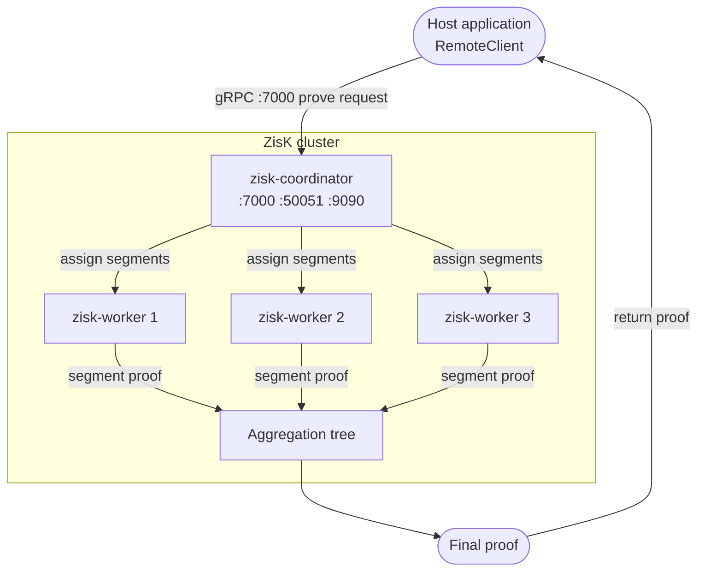
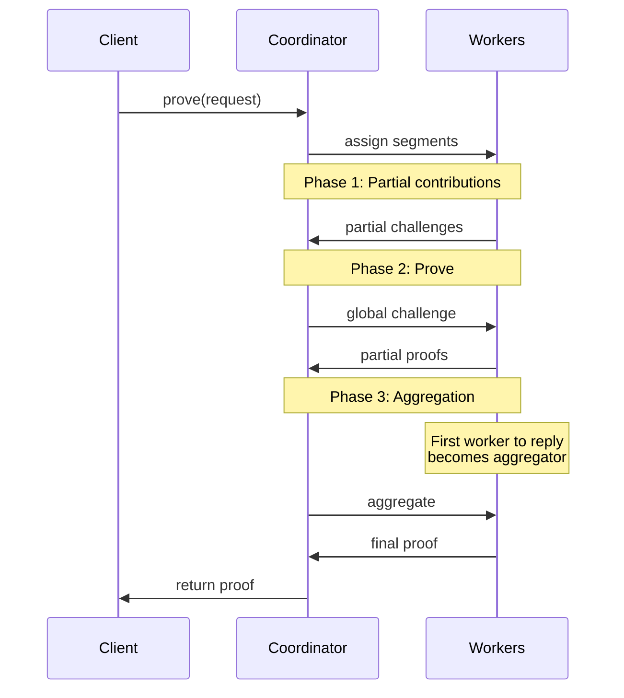
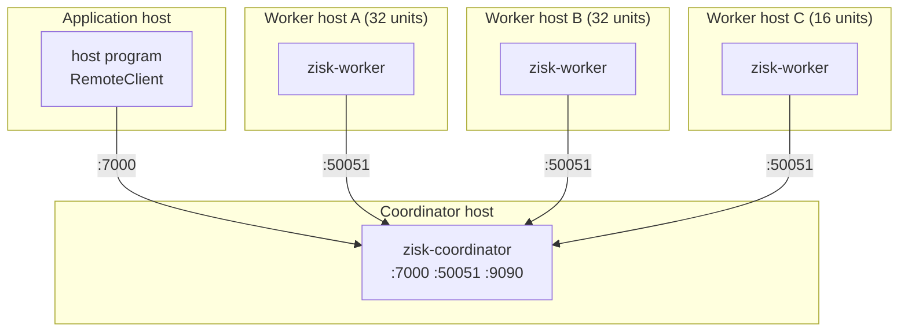

# Distributed Execution

Generating a ZisK proof means proving the full execution trace of a
program. For real workloads, that trace is too large and too slow to
prove on a single machine. A ZisK cluster splits the trace into
**segments**, proves each segment in parallel on separate machines,
and aggregates the results into a single final proof. Throughput and
latency scale with the number of machines you give it.

This guide covers the three things you need to run distributed
proving: the cluster's architecture, a single-host quickstart that
gets a job through the binaries, and the production path that
deploys the same binaries on bare Linux hosts with systemd.

---

## Architecture

A ZisK cluster is two binaries: a single `zisk-coordinator` and one
or more `zisk-worker` instances.



### The coordinator

The coordinator is the only stateful process in the cluster. It
exposes a public gRPC interface that hosts use to submit proof
requests, poll job status, and retrieve results. From the host's
point of view, the coordinator is the only endpoint it ever talks
to; workers are an invisible implementation detail.

Internally, the coordinator splits each job into segments, assigns
them to workers, and returns the final proof. It also caches the
proving keys derived from each uploaded guest ELF, so subsequent
jobs for the same program skip the expensive setup step.

### Workers

Workers are the proving processes. Each worker connects outbound to
the coordinator and waits for segment assignments. Workers are
stateless across jobs, holding only the segments they are currently
proving. You can add, remove, or restart them without touching the
coordinator or losing cluster state.

The first worker to send its partial proof to the coordinator is
automatically promoted to aggregator for that job. The aggregator
collects the remaining segment proofs and assembles the final proof,
then returns it to the coordinator.

### Proving pipeline

Once a job is submitted, the coordinator selects workers from the
available pool and runs three phases:

1. **Partial contributions.** Each assigned worker processes its
   segments and returns partial challenges. The coordinator collects
   them and derives a single global challenge.
2. **Prove.** The coordinator broadcasts the global challenge to all
   workers. Each worker computes its partial proofs and returns
   them.
3. **Aggregation.** As partial proofs arrive, the coordinator builds
   an opportunistic binary aggregation tree, folding proofs in as
   they land. The first worker to deliver its partial proof is
   promoted to aggregator and assembles the final proof.



---

## Quickstart: single-host cluster

This brings up one coordinator and one worker on the same machine,
then submits a real proving job. It is the smallest deployment that
exercises the production binaries end-to-end.

### Prerequisites

- Linux x86_64
- Rust toolchain (`cargo --version` should work)
- ~32 GB free RAM (Assembly emulator preallocates large shared regions)

Clone the repo:

```bash
git clone https://github.com/0xPolygonHermez/zisk.git
cd zisk
```

### Build the binaries

```bash
cargo build --release --bin zisk-coordinator --bin zisk-worker
```

The first build takes several minutes. The output binaries land at:

```
target/release/zisk-coordinator
target/release/zisk-worker
```

These are the same binaries used in every later deployment.

### Start the coordinator

```bash
cargo run --release --bin zisk-coordinator
```

The coordinator binds three default ports on startup:

| Port  | Purpose                                                     |
| ---   | ---                                                         |
| 7000  | Client-facing gRPC API. Host applications connect here.     |
| 50051 | Worker-facing gRPC port. Workers connect here.              |
| 9090  | Prometheus metrics endpoint and `/health` liveness probe.   |

A healthy startup log shows three "listening on" lines:

```
INFO Starting ZisK Coordinator
INFO server listening on 0.0.0.0:7000
INFO worker port listening on 0.0.0.0:50051
INFO metrics listening on 0.0.0.0:9090
```

If the coordinator exits with `Address already in use`, override the
offending port:

```bash
cargo run --release --bin zisk-coordinator -- \
    --api-port 8000 --cluster-port 60000 --metrics-port 5245
```

### Start a worker

In a second terminal:

```bash
cargo run --release --bin zisk-worker -- \
    --config distributed/crates/worker/config/dev.toml
```

`dev.toml` points the worker at `http://127.0.0.1:50051`, advertises
ten compute units, and sets the log level to debug. On a successful
handshake:

```
INFO connecting to coordinator http://127.0.0.1:50051
INFO registered as worker <random-uuid> (capacity 10)
INFO heartbeat ok
```

The coordinator logs the matching side:

```
INFO worker registered: <uuid> capacity=10
```

### Health check

```bash
curl http://127.0.0.1:9090/health
```

A healthy coordinator returns `200 OK` with an empty body.

### Submit a proving job

Any compiled ZisK guest works. The host program below talks to the
**remote** prover:

```rust
use zisk_sdk::{GuestProgram, ProverClient, ZiskStdin, load_program};

static PROGRAM: GuestProgram = load_program!("guest");

#[tokio::main]
async fn main() -> anyhow::Result<()> {
    let client = ProverClient::remote("http://127.0.0.1:7000").build()?;

    client.setup(&PROGRAM).run()?.await?;

    let mut stdin = ZiskStdin::new();
    stdin.write(&"Hello Zisk".to_string());

    let proof = client.prove(&PROGRAM, stdin).run()?.await?;
    proof.verify()?;

    let digest: [u8; 32] = proof.get_publics().read()?;
    println!("verified digest = 0x{}", hex::encode(digest));
    Ok(())
}
```

```bash
cargo run --release
```

The host uploads the ELF, the coordinator splits the job into
segments and hands them to the worker, the worker produces STARK
proofs, and the coordinator aggregates them into a final proof.
Verification runs locally in milliseconds.

---

## Deployment on Linux

This section deploys the same two binaries on bare Linux hosts under
systemd, the canonical path for a ZisK cluster.

### Prerequisites

- One Linux host with `sudo` for the coordinator
- One or more Linux hosts with `sudo` for workers, each with 64 GB
  RAM (Assembly emulator) or 32 GB (Rust emulator)
- Every worker must reach the coordinator; keep all hosts on the
  same private network for low coordinator/worker latency

Clone the repo on every host:

```bash
git clone https://github.com/0xPolygonHermez/zisk.git
cd zisk
```

### Install the coordinator

On the coordinator host:

```bash
sudo distributed/crates/coordinator-server/scripts/install.sh
```

The script:

- Creates the `zisk-coordinator` system user
- Drops the binary at `/usr/local/bin/zisk-coordinator`
- Writes the config at `/etc/zisk/coordinator.toml` (mode `640`)
- Creates the working directory at `/var/lib/zisk`
- Installs the systemd unit and runs `systemctl enable --now`

Verify the service:

```bash
sudo systemctl status zisk-coordinator
journalctl -u zisk-coordinator -f
```

You should see the same three "listening on" lines from the
quickstart. If the service is `failed`, journalctl shows the
underlying error (most often a port conflict or missing config
field).

#### Configure the coordinator

Every setting is optional; the binary falls back to a built-in
default for anything you leave out.

Override precedence (later wins): built-in defaults → config file →
`ZISK_COORDINATOR_*` environment variables → CLI flags.

Edit `/etc/zisk/coordinator.toml`:

**`[service]`** — coordinator identity.

| Setting       | Default              | Notes                                                            |
| ---           | ---                  | ---                                                              |
| `name`        | `"ZisK Coordinator"` | Shown in logs and status output.                                 |
| `environment` | `development`        | One of `development`, `staging`, `production`. Use `production`. |

**`[server]`** — client-facing gRPC API.

| Setting                     | Default     | Notes                                                                  |
| ---                         | ---         | ---                                                                    |
| `host`                      | `0.0.0.0`   | Listen address. Bind to a specific interface to restrict access.       |
| `port`                      | `7000`      | Client gRPC port. CLI: `--api-port`, env: `ZISK_COORDINATOR_API_PORT`. |
| `shutdown_timeout_seconds`  | `30`        | Drain time after a shutdown signal before forced exit.                 |

**`[coordinator]`** — worker-facing port and core tuning.

| Setting       | Default | Notes                                                                       |
| ---           | ---     | ---                                                                         |
| `port`        | `50051` | Worker gRPC port. CLI: `--cluster-port`, env: `ZISK_COORDINATOR_CLUSTER_PORT`. |
| `config_file` | (none)  | Optional path to a coordinator-core tuning file.                            |

**`[metrics]`** — Prometheus endpoint.

| Setting   | Default   | Notes                                                                     |
| ---       | ---       | ---                                                                       |
| `enabled` | `true`    | Set `false` to disable `/metrics`. `/health` stays available either way.  |
| `host`    | `0.0.0.0` | Listen address for the scrape endpoint.                                   |
| `port`    | `9090`    | Scrape port. CLI: `--metrics-port`, env: `ZISK_COORDINATOR_METRICS_PORT`. |

**`[logging]`** — what gets logged and where.

| Setting     | Default  | Notes                                                                              |
| ---         | ---      | ---                                                                                |
| `level`     | `info`   | `trace`, `debug`, `info`, `warn`, `error`. `RUST_LOG` takes precedence.            |
| `format`    | `pretty` | `pretty`, `json` (production aggregators), or `compact`.                           |
| `file_path` | (none)   | Rotating daily log file. Leave unset on systemd hosts; journald captures stdout.   |

After editing:

```bash
sudo systemctl restart zisk-coordinator
```

### Install workers

On each worker host:

```bash
sudo distributed/crates/worker/scripts/install.sh
```

The worker is now running with the default
`http://127.0.0.1:50051` coordinator URL — it has nothing to talk to
until you point it at your real coordinator.

#### Point the worker at the coordinator

Edit `/etc/zisk/worker.toml`:

```toml
[coordinator]
url = "http://<coordinator-host>:50051"
```

```bash
sudo systemctl restart zisk-worker
journalctl -u zisk-worker -f
```

Workers retry the connection every `reconnect_interval_seconds`
(default 5) until the coordinator answers. Start order does not
matter.

#### Configure the worker

Annotated example: `distributed/crates/worker/config/prod.toml`.

Override precedence: built-in defaults → config file →
`ZISK_WORKER__*` environment variables (double underscore as table
separator) → CLI flags.

Edit `/etc/zisk/worker.toml`:

**`[worker]`** — identity, capacity, on-disk location.

| Setting                          | Default                        | Notes                                                                                                                |
| ---                              | ---                            | ---                                                                                                                  |
| `worker_id`                      | random UUID                    | Pin to e.g. the hostname so log correlation works at scale.                                                          |
| `compute_capacity.compute_units` | `10`                           | Start at one unit per physical CPU core (minus two for OS overhead), plus one per GPU stream.                        |
| `environment`                    | `development`                  | `development` or `production`.                                                                                       |
| `inputs_folder`                  | `/var/lib/zisk-worker/inputs`  | Where the worker writes intermediate input files. Override only for a faster disk or separate partition.             |

**`[coordinator]`** — registration target.

| Setting | Default                    | Notes                                              |
| ---     | ---                        | ---                                                |
| `url`   | `http://127.0.0.1:50051`   | gRPC URL of the coordinator's worker-facing port.  |

**`[connection]`** — reaction to network trouble.

| Setting                      | Default | Notes                                                                |
| ---                          | ---     | ---                                                                  |
| `reconnect_interval_seconds` | `5`     | Backoff between reconnect attempts when the coordinator is unreachable. |
| `heartbeat_timeout_seconds`  | `30`    | How long to wait for a heartbeat before treating the connection dead.   |

**`[logging]`** — same shape as the coordinator's `[logging]`
table.

After editing:

```bash
sudo systemctl restart zisk-worker
```

### Add more workers

Run the install script on as many hosts as you want. All workers
register against the same coordinator and receive work proportional
to their advertised capacity.



### CLI references

A handful of operational knobs are CLI-only and not exposed in the
TOML:

| Flag                            | Default               | Description                              |
| ---                             | ---                   | ---                                      |
| `--proving-key`                 | `~/.zisk/provingKey`  | Path to the proving-key folder           |
| `--elf`                         | (none)                | Path to the ELF file                     |
| `--hints`                       | `false`               | Enable precompile hints processing       |
| `--shared-tables`               | `false`               | Share tables when running in a cluster   |
| `--verify-constraints`          | `false`               | Verify constraints after witness gen     |
| `-n`, `--number-threads-witness`| (none)                | Threads for witness computation          |
| `-t`, `--max-streams`           | (none)                | Maximum GPU streams                      |

CLI flags override the config file for one-off testing:

```bash
zisk-coordinator --api-port 8000 --cluster-port 60000 --log-level debug
zisk-worker --coordinator-url http://prod-coord:50051 --compute-capacity 32
```
