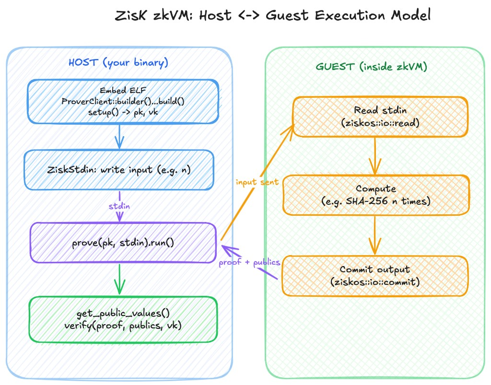

# Proving Workflow

This page walks through the full flow of generating and verifying a ZisK proof: you embed the guest program, build the prover, set up keys, feed input to the guest, run the prover to generate a proof, then verify it. Each section below is one step, with the host code that goes with it.

We use the **sha-hasher** example: the **guest** runs inside the zkVM, reads a number `n`, runs SHA-256 `n` times, and commits the result; the **host** is the binary that builds the prover, supplies `n`, and verifies the proof. The diagram below summarizes how host and guest connect.




For types and builder options, see [Builder and Types](./builder_and_types.md).

## Table of Contents

1. [Embedding the Program's ELF File](#1-embedding-the-programs-elf-file)
2. [Providing Input for the Program](#2-providing-input-for-the-program)
3. [Initializing the Prover and Setting Up the Program](#3-initializing-the-prover-and-setting-up-the-program)
4. [Executing the Program](#4-executing-the-program)
5. [Generating the Proof](#5-generating-the-proof)
6. [Reading the Public Values](#6-reading-the-public-values)
7. [Verifying the Proof](#7-verifying-the-proof)
8. [Saving the Proof (Optional)](#8-saving-the-proof-optional)
9. [Running the Example](#9-running-the-example)

---

## 1. Embedding the Program's ELF File

The host must load the guest program's binary. In sha-hasher, the guest crate is `sha-hasher-guest`; the host embeds its ELF at compile time with `include_elf!`. The macro gets the path from the `ZISK_ELF_*` environment variable, which is set when the host's `build.rs` calls `build_program("../path/to/guest")`. That compiles the guest and makes the ELF available to the host. This `ELF` is what the prover will run in steps 4 and 5.

**Host code:**

```rust
use zisk_sdk::{ElfBinary, include_elf};

const ELF: ElfBinary = include_elf!("sha-hasher-guest");
```

`build.rs` must call `build_program` for the guest so `include_elf!` can resolve. For a runtime file path (e.g. `ElfBinaryFromFile`), use `elf_path!`:

```rust
use zisk_sdk::elf_path;

let path = elf_path!("sha-hasher-guest");
```

---

## 2. Providing Input for the Program

The guest (sha-hasher-guest) reads one value: the number of iterations `n` (a `u32`). The host must supply that value in a `ZiskStdin` so that when the prover runs the guest, it sees the same input. Create stdin with `ZiskStdin::new()` and append values with `.write(&value)`; the guest reads them with `ziskos::io::read::<T>()` in the same order and types (bincode on both sides). The same `stdin` is passed to `execute` or `prove` in the next steps.

**Host code:**

```rust
use zisk_sdk::{ZiskStdin, ZiskIO};

let n = 1000u32;
let stdin = ZiskStdin::new();
stdin.write(&n);
```

For raw bytes the host uses `.write_slice(&[u8])` and the guest uses `ziskos::read_input_slice()`. You can load stdin from a file (`ZiskStdin::from_file(path)`, `ZiskStdin::from_uri(...)`) or save it with `.save(path)` for reuse (e.g. with the CLI). If the guest reads no input, use `ZiskStdin::null()`.

---

## 3. Initializing the Prover and Setting Up the Program

The host builds a prover from `ProverClient::builder()`: choose a backend (`.emu()` or `.asm()`), then an operation (`.prove()`, `.verify_constraints()`, or `.witness()`), then `.build()`. Call `ProverClient::builder()` only once per process and reuse the prover. Before running or proving, call `setup(&ELF)?` to get a proving key and verification key `(pk, vk)` for that ELF. You use `pk` to run the guest and `vk` to verify the proof later.

**Host code:**

```rust
use zisk_sdk::ProverClient;

let client = ProverClient::builder().emu().prove().build()?;
let (pk, vk) = client.setup(&ELF)?;
```

---

## 4. Executing the Program

You can run the guest without generating a proof by calling `execute`. The prover runs the guest ELF (sha-hasher-guest) with the stdin you built; the guest reads `n`, hashes `n` times, and commits its output. You get back a `ZiskExecuteResult` with cycle count, duration, and the public outputs. Use this for fast iteration or to check the committed values. The same `client` and `pk` are used in the next step to generate a proof.

**Host code:**

```rust
let result = client.execute(&pk, stdin.clone())?;
println!("Cycles: {}", result.get_execution_steps());
let output: Output = result.get_public_values()?;
```

---

## 5. Generating the Proof

To produce a proof, call `client.prove(&pk, stdin)`; that returns a builder. Chain `.run()` (STARK), `.compressed().run()` (compressed STARK), or `.plonk().run()` (SNARK, requires the prover to have been built with `.snark()`). The prover runs the guest again with the same stdin and produces a proof and the public outputs. You can pass options like `.with_proof_options(ProofOpts::default().minimal_memory())` before `.run()`.

**Host code:**

```rust
use zisk_sdk::ProofOpts;

let result = client.prove(&pk, stdin)
    .with_proof_options(ProofOpts::default().minimal_memory())
    .run()?;
```

---

## 6. Reading the Public Values

In sha-hasher, the guest commits an `Output` struct with `ziskos::io::commit(&value)`. The prove result (and the execute result from step 4) expose these as *publics*. On the host, use `.get_public_values::<T>()` with the same type the guest committed to deserialize; or `.get_publics()` for the raw `ZiskPublics` (e.g. to pass to `verify`).

**Host code:**

```rust
let output: Output = result.get_public_values()?;
```

---

## 7. Verifying the Proof

The host verifies that the proof is valid for the given publics and program. Pass the proof, the publics, and the verification key `vk` (from `setup(&ELF)?` in step 3, or from `result.get_program_vk()`).

**Host code:**

```rust
client.verify(result.get_proof(), result.get_publics(), &vk)?;
```

---

## 8. Saving the Proof (Optional)

Complete bundle (proof, publics, program VK): `result.save_proof_with_publics("proof_with_publics.bin")?`. Proof only: `result.get_proof().save("proof.bin")?`. Load bundle: `ZiskProofWithPublicValues::load("proof_with_publics.bin")?`; load proof: `ZiskProof::load("proof.bin")?`. Then `client.verify(loaded.get_proof(), loaded.get_publics(), &vk)?`.

```rust
result.save_proof_with_publics("proof_with_publics.bin")?;
let loaded = ZiskProofWithPublicValues::load("proof_with_publics.bin")?;
client.verify(loaded.get_proof(), loaded.get_publics(), &vk)?;
```

---

## 9. Running the Example

From the repository root:

```bash
cargo run --release --manifest-path examples/Cargo.toml --bin prove
```

From the `examples/` directory:

```bash
cargo run --release --bin prove
```

The `prove` binary is the host; it uses the sha-hasher-guest ELF. Full reference for types and options: [Builder and Types](./builder_and_types.md).
