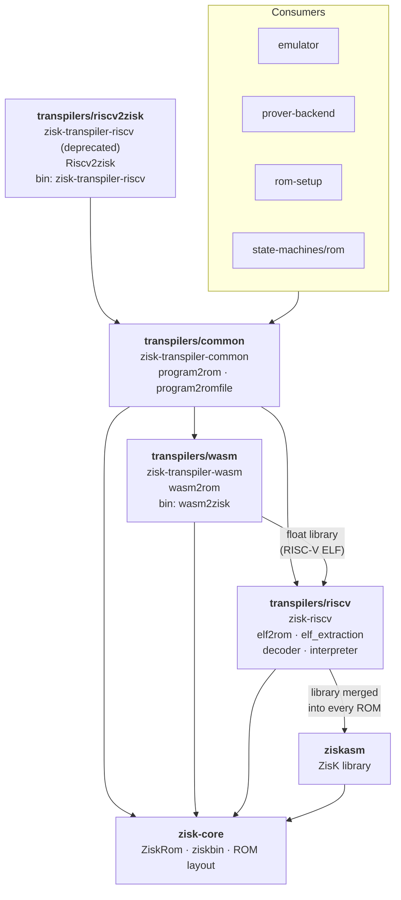

# Transpilers

The transpilers turn a guest program into a `ZiskRom`, the instruction ROM that the ZisK emulator
and prover execute. Two guest formats are supported, RISC-V ELF and WebAssembly, plus prebuilt
ziskbin ELFs that already contain a ROM.

## Layout

| Folder | Crate | Responsibility | Binary |
|---|---|---|---|
| `riscv/` | `zisk-riscv` | RISC-V only: decoder, interpreter, RISC-V → ZisK instruction translation, ELF extraction, `elf2rom` | — |
| `wasm/` | `zisk-transpiler-wasm` | WebAssembly only: module parsing, lowering, WASI, `wasm2rom` | `wasm2zisk` |
| `common/` | `zisk-transpiler-common` | Entry point: detects the guest format and calls the right transpiler (`program2rom`, `program2romfile`, `ZiskTranspiler`) | — |
| `riscv2zisk/` | `zisk-transpiler-riscv` | Deprecated, compatibility only: the dispatcher's original crate name and `Riscv2zisk` API, on top of `common` | `zisk-transpiler-riscv` |

Code that only manipulates a `ZiskRom` and is not tied to any guest format (ROM entry/exit
layout, `add_end_and_lib`, `InlineBody`, `FLOAT_HANDLER_ADDR`, `normalize_rw_data_sections`)
lives in `zisk-core`, below all three crates.

## Dependencies

Rules that keep this graph acyclic:

- Dependencies only point downward. `riscv` and `wasm` never depend on `common`; anything they
  share goes into `zisk-core`.
- `wasm` depends on `riscv` because WebAssembly floating point is implemented by the RISC-V float
  library, which is loaded from an ELF and translated with the RISC-V code.
- `ziskasm` depends only on `zisk-core`. It must not depend on `riscv`, since `riscv` uses
  `ziskasm` to merge the ZisK library into every RISC-V ROM.

## Format dispatch

`program2rom(bytes)` in `common` picks the transpiler from the file's magic bytes:

| Input | Detected by | Handled by |
|---|---|---|
| WebAssembly | `\0asm` | `zisk_transpiler_wasm::wasm2rom` |
| ziskbin ELF (prebuilt ROM from `ziskasm`) | ELF with `e_machine == EM_ZISK` | `zisk_core::ziskbin::ziskbin2rom` |
| RISC-V ELF | any other `\x7fELF` | `zisk_riscv::elf2rom` |

`program2romfile` does the same and then writes the ROM as x86-64 assembly with
`ZiskRom2Asm::save_to_asm_file`.

Published crate and binary names never change, so they don't all match their folders. The
dispatcher was first published as `zisk-transpiler-riscv`, so that crate still exists in
`riscv2zisk/`, deprecated (see [Deprecated API](#deprecated-api)). It also builds the
`zisk-transpiler-riscv` binary, a thin wrapper around `program2romfile` that accepts every format
despite its name. The binary is not deprecated.

Consumers (emulator, prover, ROM setup) should depend on `zisk-transpiler-common` and call
`program2rom` rather than a format-specific crate, so that new guest formats only need changes
here.

## Deprecated API

The library API of the `zisk-transpiler-riscv` crate is deprecated since 1.4.0. It still
compiles, but every use produces a deprecation warning, and it will not get new features. Nothing
in this workspace uses it.

To migrate, depend on `zisk-transpiler-common` instead of `zisk-transpiler-riscv`, and replace:

| Deprecated (`zisk_transpiler_riscv::…`) | Replacement (`zisk_transpiler_common::…`) |
|---|---|
| `Riscv2zisk` | `ZiskTranspiler` |
| `Riscv2zisk::new(bytes)` | `ZiskTranspiler::new(bytes)` |
| `Riscv2zisk::run()` | `ZiskTranspiler::run()` |
| `Riscv2zisk::runfile(…)` | `ZiskTranspiler::runfile(…)` (same arguments) |
| `Riscv2zisk::elf` field | `ZiskTranspiler::program` field |
| `program2rom(bytes)` | `program2rom(bytes)` |

The replacements behave the same: they accept RISC-V ELF, ziskbin ELF and WebAssembly input.
