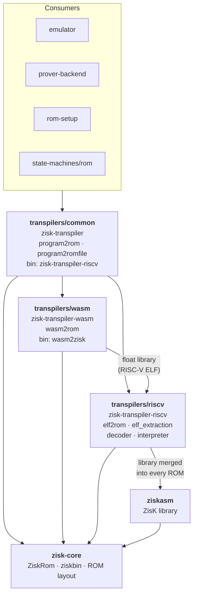

# Transpilers

The transpilers turn a guest program into a `ZiskRom`, the instruction ROM that the ZisK emulator
and prover execute. Two guest formats are supported, RISC-V ELF and WebAssembly, plus prebuilt
ziskbin ELFs that already contain a ROM.

> **Status:** this describes the target layout of the transpiler refactor
> (`feature/refactor_transpiler`). Until that work lands, the dispatcher still lives in
> `transpilers/riscv2zisk` and the ELF code in `transpilers/common`.

## Layout

| Folder | Crate | Responsibility | Binary |
|---|---|---|---|
| `riscv/` | `zisk-transpiler-riscv` | RISC-V only: decoder, interpreter, RISC-V → ZisK instruction translation, ELF extraction, `elf2rom` | — |
| `wasm/` | `zisk-transpiler-wasm` | WebAssembly only: module parsing, lowering, WASI, `wasm2rom` | `wasm2zisk` |
| `common/` | `zisk-transpiler` | Entry point: detects the guest format and calls the right transpiler (`program2rom`, `program2romfile`, `ZiskTranspiler`) | `zisk-transpiler-riscv` |

Code that only manipulates a `ZiskRom` and is not tied to any guest format (ROM entry/exit
layout, `add_end_and_lib`, `InlineBody`, `FLOAT_HANDLER_ADDR`, `normalize_rw_data_sections`)
lives in `zisk-core`, below all three crates.

## Dependencies

Rules that keep this graph acyclic:

- Dependencies only point downward. `riscv` and `wasm` never depend on `common`; anything they
  share goes into `zisk-core`.
- `wasm` depends on `riscv` because WebAssembly floating point is implemented by the RISC-V float
  library, which is loaded from an ELF and translated with the RISC-V code.
- `ziskasm` depends only on `zisk-core`. It must not depend on `riscv`, since `riscv` uses
  `ziskasm` to merge the ZisK library into every RISC-V ROM.

## Format dispatch

`program2rom(bytes)` in `common` picks the transpiler from the file's magic bytes:

| Input | Detected by | Handled by |
|---|---|---|
| WebAssembly | `\0asm` | `zisk_transpiler_wasm::wasm2rom` |
| ziskbin ELF (prebuilt ROM from `ziskasm`) | ELF with `e_machine == EM_ZISK` | `zisk_core::ziskbin::try_elf_to_rom` |
| RISC-V ELF | any other `\x7fELF` | `zisk_transpiler_riscv::elf2rom` |

`program2romfile` does the same and then writes the ROM as x86-64 assembly with
`ZiskRom2Asm::save_to_asm_file`. The `zisk-transpiler-riscv` binary is a thin wrapper around it;
its name is kept for compatibility with release bundles and install scripts, even though it now
accepts every format.

Consumers (emulator, prover, ROM setup) should depend on `zisk-transpiler` and call
`program2rom` rather than a format-specific crate, so that new guest formats only need changes
here.
